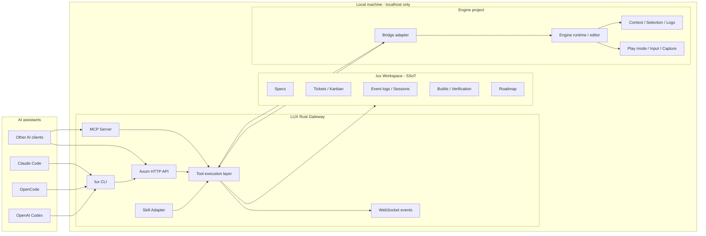

# LUX - 게임 자동화를 위한 로컬 우선 Server/MCP 증거 루프

언어: [English](README.md) | **한국어**

영어 README가 기준 문서입니다. 제품 방향이나 저장소 구조가 바뀌면 먼저 `README.md`를 업데이트하고, 이 문서는 그 내용을 한국어로 맞춰 반영합니다.

**LUX** = **L**inalab **U**nity **X**

LUX는 게임 프로젝트를 위한 로컬 우선 서버/MCP 증거 기반 자동화 컨트롤 플레인입니다. AI 코딩 도구와 엔진 프로젝트 사이에 설치형 브릿지 어댑터를 두고, 런타임 진실을 `.lux/` 아래에 기록하며, CLI, HTTP/WebSocket, MCP 표면으로 검증된 프로젝트 상태를 노출합니다.

Unity가 public beta의 기본 검증 엔진 경로입니다. Godot과 Three.js는 명시적인 capability tier 안에서만 설명해야 하며, 계획됨, 부분 구현, adapter-only 상태를 완료된 제품 동작처럼 말하면 안 됩니다.

## LUX가 무엇인가요?

LUX는 Unity 패키지도 아니고 대상 게임 프로젝트도 아닙니다. AI 어시스턴트와 엔진 프로젝트 사이에서 동작하는 독립 로컬 서버 및 CLI입니다.

기존 AI 코딩 도구는 소스 파일은 이해하지만 현재 엔진 상태를 직접 보지 못합니다. 선택된 오브젝트, PlayMode, 컴파일 로그, 씬 계층, 좌표, 카메라 상태, UI 레이아웃, 스크린샷, 실행 결과 같은 표면을 LUX가 관측 가능하고 반복 가능한 증거로 만듭니다.

기본 흐름은 다음과 같습니다.

1. 대상 프로젝트에 엔진 브릿지 어댑터를 설치합니다.
2. Rust 게이트웨이를 로컬에서 실행합니다.
3. AI 도구가 CLI, HTTP/WebSocket, MCP 명령을 사용합니다.
4. 런타임 진실과 증거를 `.lux/` 아래에 기록합니다.
5. 엔진 상태, 컴파일/테스트/실행 출력, 스크린샷, 로그, 구조화된 run evidence로 동작을 검증합니다.

## LUX 리듬

LUX는 고정된 루프로 움직입니다. 로컬 진실을 캡처하고, 증거로 결정하고, 게이트웨이를 통해 행동하고, 엔진 또는 `.lux/`로 검증한 뒤, 그 결과를 지속 가능한 컨텍스트로 다시 기록합니다. 이 루프는 단순 코드 수정만큼 빠르지는 않지만, AI agent가 오래된 가정만으로 진행했다고 주장하는 일을 막습니다.

1. **관측** - `.lux/`, 프로젝트 파일, 엔진 capability 상태, Unity bridge 상태, 로그, 씬 계층, 스크린샷, 최근 실행 증거를 읽습니다.
2. **라우팅** - 엔진과 작업에 맞는 검증 표면을 선택합니다. Unity는 전체 bridge-backed 경로를 사용할 수 있고, Godot과 Three.js는 선언된 maturity tier 안에 머물러야 합니다.
3. **행동** - 런타임 상태를 우회 경로로 바꾸지 않고 Rust gateway를 통한 CLI, HTTP/WebSocket, MCP, bridge 명령으로 실행합니다.
4. **검증** - 동작을 완료로 말하기 전에 compile/test/run/status 증거를 캡처합니다.
5. **투영** - 검증된 상태를 README, `docs/`, skills, CLI 출력, `.lux/` summary로 노출하되 계획된 capability를 완료된 capability로 바꾸지 않습니다.

이 리듬 때문에 LUX는 GUI 제품, 원격 스트리밍 스택, 대상 게임 저장소가 아니라 로컬 우선 컨트롤 플레인입니다.

## 콘텐츠 영역

| 영역 | 무엇인가 | 들어가는 것 | 들어가면 안 되는 것 |
| --- | --- | --- | --- |
| `.lux/` | 런타임 진실 | spec, capability 상태, ticket, event, roadmap, session, run evidence | 중복 cache truth 또는 손으로 유지하는 docs-only 상태 |
| `gateway/` | 컨트롤 플레인 런타임 | Rust CLI, Axum HTTP/WS 서버, MCP tools, endpoint routing, engine command orchestration | Unity Editor window, dashboard, frontend app |
| `crates/` | 공유 Rust package | gateway 책임에서 분리한 reusable core logic | `gateway/`에 있어야 하는 server wiring |
| `bridge/` | 저장소 내부 엔진 브릿지 소스 | Unity C# bridge package, Godot adapter files, `lux bridge install`이 대상 프로젝트로 복사할 수 있는 Three.js adapter sources | Git submodule, 외부 bridge repository, 대상 Unity 프로젝트 상태, vendored dependency directory |
| `Skills/` | agent workflow library | manifest-backed skill, reference, catalog, target project로 투영되는 template | gateway/bridge 증거 없이 workflow가 engine-verified라고 주장하는 내용 |
| `docs/` | 사람이 읽는 projection | usage, ADR, support tier, roadmap 설명, design constraint | `.lux/`와 충돌할 때의 canonical runtime state |
| `scripts/` | 로컬 검증과 유지보수 | structure check, policy scan, smoke script, release/test helper | 장기 실행 product surface 또는 숨겨진 runtime state |

Bridge sources는 이 저장소의 일반 파일입니다. `bridge/`를 git dependency로 초기화하지 말고, `lux-bridge` 또는 다른 remote bridge repository를 가리키게 하지 마세요. bridge 동작이 바뀌면 그 source change는 설치하거나 통신하는 gateway code 옆에서 이 저장소 안에 보여야 합니다.

## 엔진 Capability Snapshot

엔진 지원은 동등한 완성도가 아니라 capability routing으로 설명합니다. Unity가 기본 검증 경로입니다. Godot과 Three.js는 실제로 지원되는 명령과 증거 수준만 노출합니다.

| 엔진 | 공개 maturity | 메모 |
| --- | --- | --- |
| Unity | verified | bridge, status, compile/test/run evidence의 기본 public-beta 경로 |
| Godot | partial | detection, bridge install, status, workflow skill projection만 지원하며 build/run/test는 아직 unsupported |
| Three.js | planned | adapter file은 있을 수 있지만 runtime harness가 존재하고 검증되기 전까지 planned 상태 |

| Capability | Unity | Three.js | Godot |
| --- | --- | --- | --- |
| Project detection | verified | planned | verified |
| `.lux` workspace | verified | planned | planned |
| Bridge install | verified | planned | `--type godot`으로 verified |
| Status | verified | planned | `gopeak.*`와 `lux.*` field를 분리해 verified |
| Build/run/test | Unity path에서 verified | planned | GoPeak 기반 verification 전까지 unsupported |
| `.agents` workflow skill | verified | planned | `lux-godot`으로 verified |

Godot별 capability 상태는 [`docs/godot-support.md`](docs/godot-support.md)를 확인하세요.

## 아키텍처



## 핵심 표면

### Game Context Adapter

LUX는 vision-first가 아니라 context-first입니다. AI agent가 게임 동작을 수정하거나 완료를 주장하기 전에 필요한 증거를 표준화합니다.

| 관측 단위 | 목적 |
| --- | --- |
| GDD/spec map | 게임 의도와 도메인 결정을 `.lux/specs` 아래에 둡니다. |
| Scene hierarchy | 활성 씬, GameObject, 부모/자식 구조를 읽습니다. |
| Selected object and components | Transform, RectTransform, Collider, Renderer, script, reference를 확인합니다. |
| Coordinates and camera | world/screen coordinate, camera target, 2D/3D axis assumption을 검증합니다. |
| UI layout | Canvas, anchor, RectTransform, 화면 밖 배치를 확인합니다. |
| Console and compile logs | 코드 변경과 실제 실패 원인을 연결합니다. |
| PlayMode and input trace | runtime loop, input replay, play-state behavior를 검증합니다. |
| Screenshot / vision evidence | 가능한 경우 text/JSON state를 먼저 캡처한 뒤 visual evidence를 보조로 사용합니다. |
| Ticket / run / capability links | 관측 결과를 `.lux/`, ticket, run evidence, engine capability state에 연결합니다. |

### CLI

자주 쓰는 명령:

```bash
# Gateway 설치와 실행
cargo install --path gateway
lux serve

# 대상 프로젝트 초기화와 Unity bridge 설치
cd /path/to/your/project
lux init
lux bridge install --project-path /path/to/your/unity-project
lux mcp install --project-path /path/to/your/unity-project

# Unity 상태와 검증
lux unity status
lux unity context
lux unity compile
lux unity run-tests
lux unity play
lux unity screenshot

# Specs, roadmap, tickets
lux spec
lux spec edit gdd
lux spec validate
lux roadmap status
lux kanban
lux verify

# Skills and logs
lux skill list
lux skill info my-skill
lux ai-log recent
lux ai-log tail
```

### HTTP, WebSocket, MCP

대표 API 표면:

| 표면 | 예시 |
| --- | --- |
| Health | `GET /health`, `GET /api/health`, `POST /api/heartbeat`, `GET /schema` |
| Project and bridge | `POST /api/project/detect`, `POST /api/bridge/install`, `POST /api/compile` |
| Unity run/capture | `GET /api/unity/runs`, `POST /api/unity/runs`, `POST /api/unity/capture/sessions` |
| Events and logs | `GET /events`, `GET /api/events`, `GET /api/ai-log`, `GET /api/ai-log/context` |
| Sessions and tools | `GET /api/sessions`, `POST /api/tools/execute`, `GET /api/tools/executions/:execution_id` |
| Lux state | `POST /api/lux/init`, `GET /api/lux/spec`, `GET /api/lux/progress/summary` |
| Build and verification | `POST /api/lux/build/start`, `POST /api/lux/verify/run`, `GET /api/lux/verify/latest` |
| Kanban and terminal | `GET /api/lux/kanban/board`, `POST /api/lux/terminal/create` |
| MCP | `lux mcp install --project-path <project>`는 프로젝트 `.mcp.json`을 작성합니다. `lux mcp --project-path <project>`는 JSON-RPC stdio로 bounded game-development loop tools를 노출합니다. |

## `.lux/specs` 게임 Spec 시스템

게임 의도와 도메인 결정은 `.lux/specs/` 아래에 있습니다. README 파일과 `docs/`는 그 상태를 사람이 읽기 좋게 투영한 문서입니다. 실제 게임 요구사항 변경은 `.lux/specs/spec.json`, `.lux/specs/gdd.md`, `.lux/specs/domains/*.md`, `.lux/specs/decisions.jsonl` write path를 통해 기록해야 합니다.

| 도메인 | 목적 |
| --- | --- |
| `gdd` | 게임 의도와 플레이어 약속 |
| `mechanics` | 핵심 규칙과 상호작용 |
| `controls` | 입력, 조작, 접근성 |
| `camera` | 시점, 추적, 화면 좌표 |
| `levels` | 레벨 구조와 진행 |
| `art-style` | 비주얼 아트 방향 |
| `audio` | 오디오 디자인 |
| `narrative` | 스토리와 대화 |
| `ui-ux` | UI/UX specification |
| `technical-architecture` | 시스템 아키텍처 |
| `engine` | Unity/Godot/Three.js capability routing |
| `testing` | 자동 테스트와 수동 QA 전략 |
| `build-release` | 빌드, 릴리스, 배포 |

## 저장소 구조

```text
Lux/
├── gateway/                        # Rust CLI + Axum HTTP/WS server
│   ├── src/
│   │   ├── main.rs                 # CLI entry point
│   │   ├── server.rs               # Axum router
│   │   ├── protocol.rs             # Event envelope and bridge protocol
│   │   ├── project.rs              # Unity project detection
│   │   ├── project_godot.rs        # Godot project detection
│   │   ├── bridge_types.rs         # Bridge type definitions
│   │   ├── godot_bridge_install.rs # Godot bridge install path
│   │   ├── lux_*.rs                # Lux core modules
│   │   ├── uloop_*.rs              # Unity CLI passthrough
│   │   ├── skill_adapter/          # Skill loading and adaptation
│   │   └── templates/              # Gateway-managed templates
│   ├── tests/
│   └── Cargo.toml
│
├── crates/                         # Shared Rust core packages
├── bridge/                         # Engine bridge adapters, in-repo source
│   ├── unity/                      # Unity C# bridge
│   ├── godot/                      # Godot bridge
│   └── threejs/                    # Three.js adapter files
├── Skills/                         # Skill source tree
├── docs/                           # Human-readable docs and ADRs
├── scripts/                        # Verification and maintenance scripts
├── Cargo.toml
├── Cargo.lock
└── LICENSE
```

## Roadmap Reality

정식 roadmap과 milestone 상태는 `.lux/roadmap.json`에 있습니다. 사용자/게임 요구사항, 실행 ticket, active run state는 `.lux/specs/spec.json`, `.lux/specs/domains/*.md`, `.lux/tickets/*.json`, `.lux/run-state.json` 같은 ADR-003 domain path 아래에 있습니다.

| Phase | 이름 | 상태 | 설명 |
| --- | --- | --- | --- |
| A | Core Gateway & CLI | complete | Rust gateway, CLI, bridge adapter integration |
| B | AI Event System | complete | event logging, JSONL, session API |
| C | Server and MCP Control Plane | complete | Rust CLI, HTTP/WS API, MCP server |
| D | Agent Workflow Skill Projection | partial | manifest inventory와 target-project skill projection |
| E | Ticket-driven Agent Execution | planned/scaffolded | legacy adapter root 없는 gateway/MCP evidence path |

현재 public-beta framing에서 범위 밖인 것:

- 외부 GitHub milestone/issue sync.
- experimental flag로 명시적으로 gate되지 않은 WebRTC 또는 remote video streaming.
- browser 기반 Unity Editor remote control.
- iOS companion app 또는 PWA.
- 문서화된 capability tier 밖의 Windows/Linux editor support.

## 핵심 불변성

이 저장소는 `alex-core-invariants`에서 확장한 여섯 가지 불변성을 따릅니다.

| # | 불변성 | Lux guidance |
| --- | --- | --- |
| 1 | SSoT | `.lux/`가 spec, ticket, log, roadmap, session, run evidence를 소유합니다. |
| 2 | SoC / SRP | Gateway는 server와 CLI, bridge는 engine protocol, Skills는 workflow를 소유합니다. |
| 3 | Consistency | event schema, API response shape, bridge protocol message는 서로 맞아야 합니다. |
| 4 | Atomicity | multi-step bridge/API operation은 완전히 끝나거나 관측 가능한 실패로 끝나야 합니다. |
| 5 | Idempotency | 반복되는 bridge install, heartbeat, status operation은 수렴해야 합니다. |
| 6 | No Silent Fallback | observable evidence 없이 empty/default data를 반환하거나 legacy path로 fallback하지 않습니다. |

허용 transition marker:

- `// lux-allow-failover`
- `// lux-allow-legacy`
- `// lux-allow-dual-write`

## 검증

```bash
# Rust
cargo build --workspace
cargo test --workspace

# Project checks
bash scripts/check-project-structure.sh
bash scripts/check-readme-bridge-contract.sh
bash scripts/test-all.sh --quick

# CLI help
cd gateway && cargo run -- bridge install --help
cd gateway && cargo run -- serve --help
```

Unity bridge tests는 Unity Editor가 필요하며 bridge package의 Unity Test Runner에서 실행해야 합니다.

## 라이선스

Copyright (c) 2024-2026 Linalab. All rights reserved.
