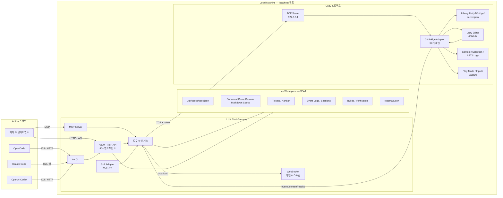

# LUX — Local-first Server/MCP Evidence Loop for Game Automation

**LUX** = **L**inalab **U**nity **X**

LUX is a local-first server/MCP evidence-gated automation control plane for game projects. It supports Unity, Three.js, and Godot projects through explicit capability tiers.
Its game-development direction is **context-first**: LUX turns game intent, project structure, engine state, scene hierarchy, object properties, coordinates, logs, screenshots, and verification results into stable AI-readable evidence before any agent claims progress. Unity remains the primary public-beta verified engine.
Three.js and Godot use explicit capability maturity tiers so AI tools do not confuse planned, partial, or adapter-only capabilities with verified LUX commands.

The implementation is split across core Rust packages, gateway wiring, bridge sources, and bundled skills. The current docs describe that split as a repository docs projection of the live repository shape, not a claim that autonomous game-development milestones are already complete.

AI 코딩 도구가 Unity Editor와 Godot/Three.js 프로젝트 상태를 안전하게 확인하고 증거 기반으로 다음 행동을 결정하게 하는 **독립형 서버/MCP 자동화 컨트롤 플레인**입니다. LUX는 비전 모델이나 UI 대시보드를 제품 중심에 두지 않고, 먼저 씬/오브젝트/컴포넌트/좌표계/카메라/UI/콘솔 로그를 텍스트와 JSON 컨텍스트로 고정한 뒤 필요한 경우 스크린샷·비전 피드백을 보조 증거로 연결합니다.

> **"Local-first"** — 모든 기능은 `localhost`에서 작동합니다. 보안과 성능을 위해 원격 스트리밍이나 외부 클라우드 의존성을 최소화합니다.

## LUX가 무엇인가요?

LUX는 **Unity 패키지가 아닌 독립형 로컬 서버/MCP 애플리케이션**으로, AI 코딩 어시스턴트와 엔진 프로젝트 사이의 간극을 메웁니다.

기존 AI 코딩 도구는 코드는 이해하지만 Unity Editor의 GUI 상태(현재 선택된 오브젝트, PlayMode 상태, 콘솔 로그, 빌드 결과 등)를 직접 알 수 없습니다. LUX는 이 문제를 다음과 같이 해결합니다:

1. **Unity 프로젝트에 브릿지 어댑터 설치** — C# TCP 서버가 Editor 내부 상태를 수집
2. **Rust 기반 게이트웨이 서버 실행** — HTTP/WebSocket API로 외부에 노출
3. **CLI + HTTP/WebSocket/MCP API 제공** — AI 어시스턴트가 Unity를 제어

모든 런타임 상태는 프로젝트의 `.lux/` 디렉토리에 저장되어 **단일 소스 오브 트루스(SSoT)**를 유지합니다. 게임 의도와 GDD 도메인은 `.lux/specs`가 정식 소스이며, README와 `docs/` 문서는 사용자가 읽기 쉬운 repository docs projection입니다.

## Repository Layering

LUX keeps the runtime truth in `.lux/`, the executable control plane in `gateway/`, the engine bridge in `bridge/`, and bundled skill sources in `Skills/skills/`. The verification and game-context flows are projected from those layers, not the other way around.


## Engine Capability Snapshot

Engine support uses capability routing, not equal verification maturity. Unity is the primary verified path.
Three.js and Godot entries expose only the commands and evidence levels that are actually supported.

| Engine | Public maturity | Notes |
| --- | --- | --- |
| Unity | verified | Primary public-beta path for bridge, status, compile/test/run evidence. |
| Godot | partial | Detection, bridge install, status, and workflow skill projection only; build/run/test stay unsupported. |
| Three.js | planned | Runtime harness is absent in this repository snapshot. |

| Capability | Unity | Three.js | Godot |
| --- | --- | --- | --- |
| Project detection | verified | planned | verified |
| `.lux` workspace | verified | planned | planned |
| Bridge install | verified | planned | verified via `--type godot` |
| Status | verified | planned | verified with separated `gopeak.*` and `lux.*` fields |
| Build/run/test | verified for Unity paths | planned | unsupported until GoPeak-backed verification exists |
| `.agents` workflow skill | verified | planned | verified via `lux-godot` |

See [`docs/godot-support.md`](docs/godot-support.md) for Godot-specific capability status.

## 아키텍처

> [!NOTE]
> **Team-mode / Hyperplan**은 생산자 전용(Producer-only)입니다. 제안과 비평을 수행하지만 `.lux/` 상태를 직접 수정할 수 없으며, 모든 변경은 게이트웨이의 검증된 엔드포인트를 통해서만 이루어집니다.



### 통신 흐름

```
AI 어시스턴트 (터미널)
  → CLI / HTTP API / WebSocket
    → LUX Gateway (Rust)
      → Unity Bridge Adapter (C#)
        → Unity Editor
      → OR → .lux/ 상태 저장소
      → OR → WebSocket 이벤트 브로드캐스트
```

---

## 핵심 기능

### 0. Game Context Adapter — AI용 Unity 관측 계층

LUX의 게임 개발 플러그인 방향은 **Vision-first가 아니라 Context-first**입니다. AI가 Unity 프로젝트를 고칠 때 실패하는 주된 이유는 코드 지식 부족보다 현재 씬, 좌표계, 프리팹 연결, UI 배치, PlayMode 상태, 콘솔 로그, 화면 결과를 하나의 증거 루프로 보지 못하는 데 있습니다.

LUX는 다음 관측 단위를 표준 컨텍스트로 잠급니다:

| 관측 단위 | 목적 |
|---|---|
| GDD/spec map | `.lux/specs` 아래 게임 의도와 도메인 결정을 SSoT로 고정 |
| Scene hierarchy | 활성 씬, GameObject, 부모/자식 구조 파악 |
| Selected object / component snapshot | Transform, RectTransform, Collider, Renderer, Script 참조 확인 |
| Coordinate and camera state | 월드좌표/스크린좌표/카메라 타겟/2D·3D 축 혼용 문제 검증 |
| UI layout state | Canvas, anchors, RectTransform, 화면 밖 배치 문제 검증 |
| Console and compile logs | 코드 변경 후 실패 원인을 증거로 연결 |
| PlayMode and input trace | 실행 상태, 입력 재현, 런타임 루프 검증 |
| Screenshot / vision evidence | 텍스트 컨텍스트로 설명되지 않는 시각 결과를 보조 증거로 연결 |
| Ticket / run / capability links | 관측 결과를 `.lux/specs`, 실행 티켓, run evidence, 엔진 capability 상태에 연결 |

이 계층의 목표는 단순한 자동 클릭이나 원격 제어가 아니라, **AI가 게임 상태를 읽고 변경하고 검증할 수 있는 관측 표준**을 제공하는 것입니다. CLI, HTTP/WebSocket, MCP 표면은 ambiguity, decisions, capabilities, next goal, evidence status를 `.lux/` 런타임 상태에서 읽어 evidence-gated 상태로 노출하며, 스크린샷과 비전 피드백은 먼저 좌표·컴포넌트·로그·씬 상태가 텍스트/JSON으로 재현 가능할 때 보조 증거가 됩니다.

### 1. AI 어시스턴트 통합

| 기능 | 설명 |
|------|------|
| **HTTP/WS API** | 40+ 엔드포인트를 통해 AI 어시스턴트가 Unity 상태와 `.lux/` 증거를 조회/요청 |
| **MCP 표면** | `lux mcp`가 JSON-RPC stdio 클라이언트에 bounded game-development loop와 bridge/game tools를 노출 |
| **이벤트 브로드캐스트** | WebSocket(`/events`)으로 실시간 JSONL 이벤트 스트리밍 |
| **워크플로우 스킬** | `Skills/skills/`의 manifest-backed skill을 CLI/API와 target-project projection으로 사용 |

### 2. Unity Editor 제어 — CLI/API 도구

**빌드 및 테스트:**
- `unity_compile` — 유니티 프로젝트 컴파일
- `unity_test` — EditMode/PlayMode 테스트 실행
- `unity_clear_console` — Unity Console 로그 초기화

**씬 및 오브젝트:**
- `unity_hierarchy` — 씬 계층 구조 읽기
- `unity_find_game_objects` — 이름, 컴포넌트, 태그, 레이어로 검색
- `unity_dynamic_code` — Editor에서 동적 C# 코드 실행

**PlayMode 제어:**
- `unity_control_play_mode` — play/stop/pause/resume/status
- `unity_screenshot` — Editor 스크린샷 캡처
- `unity_get_logs` — 콘솔 로그 읽기
- `unity_focus_window` — Editor 창을 최상위로

**입력 시뮬레이션:**
- `unity_simulate_keyboard` — 키 입력 시뮬레이션
- `unity_simulate_mouse_ui` — UI 클릭/드래그 시뮬레이션
- `unity_simulate_mouse_input` — 게임플레이용 마우스 입력
- `unity_record_input` — PlayMode 입력 녹화
- `unity_replay_input` — 녹화된 입력 프레임 정밀 재생

**LUX 컨텍스트:**
- `lux_init` — `.lux/` 워크스페이스 초기화
- `lux_status` — 서버, 프로젝트, 세션 상태
- `lux_goals` — 목표, 로드맵, 활성 티켓
- `lux_context` — 현재 Unity 컨텍스트
- `lux_project_info` — 프로젝트 감지 및 정보
- `skill_list` / `skill_info` — 20개 스킬 탐색
- `ai_log_recent` — 최근 AI 액션 로그

**유틸리티:**
- `execute_shell` / `execute_git` — 쉘/깃 명령 실행
- `selected_file_context` — 선택된 파일 컨텍스트 읽기

### 3. CLI 명령어

```bash
# 프로젝트 설정
lux init                    # .lux/ 워크스페이스 초기화
lux init --force           # 완전 재초기화
lux bridge install -p ./MyProject   # Unity 프로젝트에 브릿지 설치

# 서버
lux serve                   # HTTP/WS 게이트웨이 서버 시작
lux serve --port 17340     # 커스텀 포트
lux serve --idle-timeout 30 # 30분 유휴 시 자동 종료

# Unity 작업
lux unity status           # Unity 프로젝트 상태 확인
lux unity context          # Editor 컨텍스트 획득
lux unity compile          # 배치 컴파일
lux unity run-tests        # 테스트 실행
lux unity play             # 프로젝트 Play
lux unity screenshot       # 스크린샷 캡처
lux unity control-play-mode --action play  # PlayMode 제어
lux unity launch           # Unity Editor 실행
lux unity get-logs         # 콘솔 로그 읽기
lux unity focus-window     # Editor 창 포커스
lux unity install-uloop    # uloop(Unity CLI passthrough) 설치 (ralph/start-work는 Lux 명령어가 아님)

# Spec & 계획
lux spec                   # Spec 상태 보기
lux spec edit gdd          # 도메인 Spec을 $EDITOR로 편집
lux spec validate          # spec.json 유효성 검사
lux roadmap status         # 로드맵 상태 보기
lux kanban                 # 칸반 보드 표시
lux build                  # WebGL 빌드 트리거
lux play                   # 최신 빌드 브라우저에서 열기
lux verify                 # 전체 검증 실행

# 스킬
lux skill list             # 설치된 스킬 목록
lux skill info my-skill    # 스킬 상세 정보
lux skill install my-skill -s ./src  # 스킬 설치
lux skill remove my-skill  # 스킬 제거
lux skill update my-skill  # 스킬 업데이트

# AI 로그
lux ai-log recent          # 최근 AI 로그 항목
lux ai-log tail            # AI 로그 실시간 추적
lux ai-log context         # AI 로그 컨텍스트
lux ai-log compact         # 로그 파일 압축

# 세션
lux session record         # 세션 녹화 시작
lux session stop           # 세션 녹화 중지
lux session replay         # 세션 재생
lux session timeline       # 세션 타임라인 보기
lux session report         # 세션 리포트 생성

# 설정
lux config show            # 현재 설정 표시
lux config get key         # 설정값 조회
lux config set key value   # 설정값 설정
lux config edit            # 설정 파일 편집
lux status                 # 서버 및 프로젝트 상태
lux schema                 # 이벤트 스키마 예시 표시
lux completion zsh         # 쉘 자동완성 생성

```

### 4. 이벤트 시스템

WebSocket(`/events`)을 통해 실시간 구조화 이벤트:

```json
{
  "schema_version": 1,
  "event_id": "uuid",
  "category": "tool|playmode|scene|log|input|screenshot|hierarchy",
  "source": "unity-editor|cli",
  "session_id": "session-uuid",
  "captured_at_utc": "2026-04-30T00:00:00.000Z",
  "payload": { }
}
```

카테고리: `playmode`, `scene`, `log`, `tool`, `input`, `screenshot`, `hierarchy`

### 5. `.lux/specs` 게임 Spec 시스템

게임 GDD와 도메인 의도는 `.lux/specs/` 아래에 저장되며, README와 `docs/`는 그 상태를 설명하는 repository docs projection입니다. 실제 게임 요구사항 변경은 `.lux/specs/spec.json`, `.lux/specs/gdd.md`, `.lux/specs/domains/*.md`, `.lux/specs/decisions.jsonl` write path를 통해 기록되어야 합니다.

| 도메인 | 목적 |
|--------|------|
| `gdd` | 게임 의도와 플레이어 약속 |
| `mechanics` | 핵심 규칙과 상호작용 |
| `controls` | 입력, 조작, 접근성 |
| `camera` | 시점, 추적, 화면 좌표 |
| `levels` | 레벨 구조와 진행 |
| `art-style` | 비주얼 아트 디렉션 |
| `audio` | 오디오 디자인 |
| `narrative` | 스토리 및 대화 |
| `ui-ux` | UI/UX 스펙 |
| `technical-architecture` | 시스템 아키텍처 |
| `engine` | Unity/Godot/Three.js capability routing |
| `testing` | 테스트와 수동 QA 전략 |
| `build-release` | 빌드, 릴리스, 배포 |

각 도메인은 ambiguity score, 결정 이력, 목표, 요구사항, 수락 기준, evidence status를 추적합니다. CLI/API/MCP와 문서가 보여주는 값은 evidence-gated projection이며, full autonomous completion이나 모든 엔진 검증 완료를 의미하지 않습니다.

---

## API 엔드포인트

### Health & Meta
- `GET /health` — 서버 준비 상태 및 프로토콜 버전
- `GET /api/health` — 서버 준비 상태
- `POST /api/heartbeat` — 활동 기록, 업타임 반환
- `GET /schema` — 이벤트 봉투 예시

### 프로젝트 & 브릿지
- `POST /api/project/detect` — Unity 프로젝트 자동 감지
- `POST /api/detect_project` — 프로젝트 감지 (legacy)
- `POST /api/bridge/install` — 브릿지 어댑터 설치
- `POST /api/compile` — 컴파일 트리거

### Unity 실행 & 캡처
- `GET /api/unity/runs` — Unity 실행 목록
- `POST /api/unity/runs` — Unity 실행 생성
- `DELETE /api/unity/runs/:id` — 실행 중지
- `GET /api/unity/runs/:id/stream` — 실행 스트림
- `ANY /api/unity/runs/:id/input` — 입력
- `POST /api/unity/capture/sessions` — 캡처 세션 생성
- `GET /api/unity/capture/sessions/:id` — 캡처 세션 조회
- `DELETE /api/unity/capture/sessions/:id` — 캡처 중지
- `GET /api/unity/capture/sessions/:id/stream` — MJPEG 스트림
- `ANY /api/unity/capture/sessions/:id/input` — 입력 WebSocket

### 이벤트 & 로그
- `GET /events` — WebSocket 이벤트 스트림 (`x-lux-token` 필요)
- `GET /api/events` — 이벤트 API
- `GET /api/ai-log` — AI 액션 로그 쿼리
- `GET /api/ai-log/context` — AI 로그 컨텍스트

### 세션
- `GET /api/sessions` — 세션 목록
- `POST /api/sessions` — 세션 생성
- `GET /api/sessions/:session_id` — 세션 조회
- `PUT /api/sessions/:session_id` — 세션 업데이트
- `DELETE /api/sessions/:session_id` — 세션 삭제

### 도구
- `GET /api/tools` — 사용 가능한 도구 목록
- `GET /api/tools/sessions` — 도구 세션 목록
- `POST /api/tools/sessions` — 도구 세션 생성
- `GET /api/tools/sessions/:session_id` — 도구 세션 조회
- `DELETE /api/tools/sessions/:session_id` — 도구 세션 삭제
- `POST /api/tools/execute` — 도구 명령 실행
- `GET /api/tools/executions/:execution_id` — 실행 결과 조회

### Lux 관리
- `POST /api/lux/init` — `.lux/` 초기화
- `GET /api/lux/spec` — Spec 조회
- `PUT /api/lux/spec` — Spec 업데이트
- `GET /api/lux/spec/ambiguity` — 모호도 점수 조회
- `GET /api/lux/progress/summary` — 진행 요약
- `GET /api/lux/continuation/state` — 컨티뉴에이션 상태
- `PUT /api/lux/continuation/state` — 컨티뉴에이션 상태 설정

### 빌드 & 검증
- `POST /api/lux/build/start` — WebGL 빌드 시작
- `GET /api/lux/build/status/:build_id` — 빌드 상태
- `GET /api/lux/build/log/:build_id` — 빌드 로그
- `POST /api/lux/build/cancel/:build_id` — 빌드 취소
- `GET /api/lux/build/list` — 빌드 목록
- `POST /api/lux/verify/run` — 검증 실행
- `GET /api/lux/verify/latest` — 최신 검증 결과

### 칸반
- `GET /api/lux/kanban/board` — 칸반 보드
- `GET /api/lux/kanban/tickets` — 티켓 목록
- `POST /api/lux/kanban/tickets` — 티켓 생성
- `PUT /api/lux/kanban/tickets/:id` — 티켓 업데이트
- `PUT /api/lux/kanban/tickets/:id/status` — 티켓 상태 변경

### 터미널
- `POST /api/lux/terminal/create` — 터미널 생성
- `POST /api/lux/terminal/:id/input` — 입력 전송
- `GET /api/lux/terminal/:id/output` — 출력 읽기
- `DELETE /api/lux/terminal/:id` — 터미널 삭제

### 그래프 & 파이프라인 (실험적)
- `GET /api/graphs` — 그래프 목록
- `POST /api/graphs` — 그래프 생성
- `POST /api/graphs/:graph_id/execute` — 그래프 실행
- `GET /api/pipeline` — 파이프라인 목록
- `POST /api/pipeline` — 파이프라인 실행

### 스킬 & 기타
- `GET /api/skills` — 스킬 목록
- `GET /api/skills/:name/adaptation` — 스킬 어댑테이션
- `GET /api/node-types` — 노드 타입 목록
- `GET /api/lux/experimental-flags` — 실험적 기능 플래그

---

## 프로젝트 구조

```
Lux/
├── gateway/                        # Rust CLI + Axum HTTP/WS 서버
│   ├── src/
│   │   ├── main.rs                 # CLI 진입점 (25+ 명령어)
│   │   ├── server.rs               # Axum 라우터 (40+ 엔드포인트)
│   │   ├── protocol.rs             # 이벤트 봉투 & 브릿지 프로토콜
│   │   ├── config.rs               # 게이트웨이 설정
│   │   ├── session.rs              # 세션 추적
│   │   ├── ai_log.rs               # AI 상호작용 로깅
│   │   ├── project.rs              # Unity 프로젝트 감지
│   │   ├── project_godot.rs        # Godot 프로젝트 감지
│   │   ├── unity_hub.rs            # Unity Hub 통합
│   │   ├── unity_launch.rs         # 배치 모드 실행
│   │   ├── capture.rs              # 스크린샷, 캡처 세션
│   │   ├── auto_update.rs          # Git SHA 기반 자동 업데이트
│   │   ├── cross_platform.rs       # macOS 유틸리티
│   │   ├── visual_regression.rs    # 시각적 회귀 테스트
│   │   ├── bridge_types.rs         # 브릿지 타입 정의
│   │   ├── addon_*.rs              # 애드온 인증, 라우트, 스토어
│   │   ├── godot_bridge_install.rs # Godot 브릿지 설치
│   │   ├── gopeak_manifest.rs      # GoPeak 매니페스트
│   │   ├── lux_*.rs                # Lux 코어 모듈 (spec, ticket, build, loop, 등)
│   │   ├── uloop_*.rs              # Unity CLI passthrough
│   │   ├── skill_adapter/          # 스킬 로딩, 어댑테이션
│   │   ├── templates/              # gateway-managed agent/MCP templates
│   │   └── lib.rs                  # 라이브러리 익스포트
│   ├── tests/                      # 통합 테스트
│   ├── build.rs
│   ├── update-manifest.json
│   └── Cargo.toml                  # Rust 의존성
│
├── crates/                         # gateway에서 분리한 Rust core package
│   ├── lux-core/
│   ├── lux-ai-core/
│   ├── lux-bridge-core/
│   ├── lux-project/
│   ├── lux-run-core/
│   ├── lux-spec-core/
│   └── lux-verification-core/
│
├── bridge/                         # 엔진 브릿지 어댑터
│   ├── unity/                      # Unity C# 브릿지
│   ├── godot/                      # Godot 브릿지
│   └── threejs/                    # Three.js 브릿지
│
├── Skills/                         # 스킬 source tree
│   ├── skills/                     # 46 total SKILL.md files, 20 manifest-backed built-in skills
│   │   ├── game-dev/
│   │   ├── lux-unity/
│   │   ├── unity-cs-reference/
│   │   ├── studio-*/
│   │   └── unity-pattern-*/
│   ├── catalogs/                   # 장르/스킬 inventory
│   ├── docs/templates/             # 설계/명세 템플릿
│   └── tools/                      # 스킬 동기화/검증 스크립트
│
├── scripts/                    # 유틸리티 스크립트
│   ├── e2e-lux-sequential-smoke.sh
│   ├── check-project-structure.sh
│   ├── policy-scan.mjs         # 불변성 정책 스캐너
│   └── test-all.sh
│
├── docs/                       # 문서
│   ├── roadmap-reality-lock.md
│   ├── usage.md
│   ├── godot-support.md
│   └── adr/                    # 아키텍처 결정 기록
├── Cargo.toml                  # Rust 워크스페이스
├── Cargo.lock
├── package.json
├── package-lock.json
└── LICENSE
```

---

## 로드맵

> [!IMPORTANT]
> LUX 제품 로드맵/마일스톤 상태의 정식 상태(SSoT)는 `.lux/roadmap.json` 파일에서 관리됩니다. 사용자/게임 요구사항, 실행 티켓, 활성 실행 상태는 각각 ADR-003의 도메인 파일(`.lux/specs/spec.json`, `.lux/specs/domains/*.md`, `.lux/tickets/*.json`, `.lux/run-state.json`)이 정식 소스입니다. 본 문서는 가독성을 위한 투영(Projection)입니다. 마일스톤 푸시(Milestone Push)는 **T3 Unity 검증**(배치 모드 컴파일 600초 + 씬 스모크 300초)을 통과해야 하며, Unity 환경을 사용할 수 없는 경우 푸시가 차단됩니다.

> [!WARNING]
> 레거시 `.lux/continuation-state.json`은 더 이상 사용되지 않으며(Deprecated), 새로운 버전의 게이트웨이 실행 시 자동으로 마이그레이션됩니다.

| Phase | 이름 | 상태 | 설명 |
|-------|------|------|------|
| **A** | Core Gateway & CLI | ✅ 완료 | Rust Gateway, CLI, 브릿지 어댑터 통합 |
| **B** | AI Event System | ✅ 완료 | 이벤트 로깅, JSONL, 세션 API |
| **C** | Server and MCP Control Plane | ✅ 완료 | Rust CLI, HTTP/WS API, MCP 서버 |
| **D** | Agent Workflow Skill Projection | 부분 구현 | `Skills/skills/` manifest inventory와 target-project skill 설치 |
| **E** | Ticket-driven Agent Execution | 계획/스캐폴드 | legacy adapter root 없이 gateway/MCP evidence path를 통해 진행 |

### 향후 마일스톤

| 마일스톤 | 설명 |
|----------|------|
| **M1** | Game Context Schema & Defaults — GDD/spec, 도메인, 씬/좌표/UI/카메라 관측 단위 표준화 |
| **M2** | 모호도 수렴 & 소크라테스 루프 (≤ 0.02) |
| **M3** | 실행 등급 티켓 스키마 |
| **M4** | 티켓 기반 agent execution + 엔진 상태 컨텍스트 주입 |
| **M5** | 블로커 자동 해결 그래프 |
| **M6 / Autonomous** | Spec → Ticket → OpenCode → 엔진 관측/검증 완전 자율 파이프라인 (계획됨) |

### 범위 외

- ❌ 외부 GitHub 마일스톤/이슈 연동 (본 로드맵 범위 외)
- ❌ WebRTC / 원격 비디오 스트리밍 (실험적, `experimental_flags.remote_webrtc=true`로 게이트)
- ❌ 브라우저에서 Unity Editor 원격 제어
- ❌ iOS companion app / PWA
- ❌ Windows/Linux 에디터 지원 (macOS-first)

---

## 빠른 시작

### 사전 요구사항

- **Unity 6000.0+** (Unity 6.x)
- **Rust toolchain** (`rustup` + `cargo`)
- **macOS** (Unity 브릿지 통합에 필요)

### 설치

```bash
# 0. Fresh clone: initialize bridge submodule
git submodule update --init bridge

# 1. LUX CLI 설치
cargo install --path gateway

# 2. Unity 프로젝트에 브릿지 설치
lux bridge install --project-path /path/to/your/unity-project
```

### 초기화 및 연동

```bash
# 3. 프로젝트 디렉토리에서 초기화
cd /path/to/your/project
lux init

# 자동 수행:
# - .lux/ 디렉토리 생성 (SSoT)
# - MCP/HTTP/WS 게이트웨이에서 사용할 spec, roadmap, engine capability 상태 생성
# - Lux workflow skills 설치 준비
```

### 실행

```bash
# 게이트웨이 서버 시작
lux serve

# Unity 상태 확인
lux unity status
```

---

## 핵심 원칙

[alex-core-invariants](https://github.com/islee23520/alex-core-invariants)에서 확장한 6가지 불변성이 모든 서브시스템을 지배합니다.

| # | 불변성 | 원칙 | LUX 가이드 |
|---|--------|------|-----------|
| 1 | **SSoT** | `.lux/`가 정식 상태입니다. 다른 소스가 이를 덮어쓸 수 없습니다. | 모든 상태는 `.lux/` 아래에 — Spec, 티켓, 로그, 로드맵, 세션 |
| 2 | **SoC / SRP** | 혼합된 책임은 모든 리팩토링을 생존시킵니다. | Gateway는 서버+CLI, Bridge는 Unity 프로토콜, Skills는 워크플로우 |
| 3 | **Consistency** | 모순은 가중됩니다. | 이벤트 스키마, API 응답 형태, 브릿지 프로토콜 메시지는 동기화를 유지해야 함 |
| 4 | **Atomicity** | 절반만 작성된 상태는 선언되지 않은 진실입니다. | 브릿지 명령은 전부 완료되거나 롤백. 다중 단계 API 작업은 트랜잭션 |
| 5 | **Idempotency** | 재시도는 수렴해야지 손상시키면 안 됩니다. | `lux bridge install`은 재실행해도 안전. Heartbeat는 동일한 요청에 동일한 결과 반환 |
| 6 | **No Silent Fallback** | 조용한 폴백은 핵심을 죽입니다. | 오류를 잡아 빈 데이터를 반환하지 마세요. 레거시 경로로 폴백하지 마세요. |

### 집행

- `node scripts/policy-scan.mjs --advisory-only` — 소스에서 불변성 위반 스캔
- `bash scripts/test-all.sh --quick` — 모든 검사 포함 정책 스캔 실행 (빠른 모드)
- 의도적 예외 주석: `// lux-allow-failover`, `// lux-allow-legacy`

---

## 검증

```bash
# Rust
cargo build --workspace
cargo test --workspace

# CLI 도움말
cd gateway && cargo run -- bridge install --help
cd gateway && cargo run -- serve --help
```

---

## 라이선스

Copyright (c) 2024-2026 Linalab. All rights reserved.
