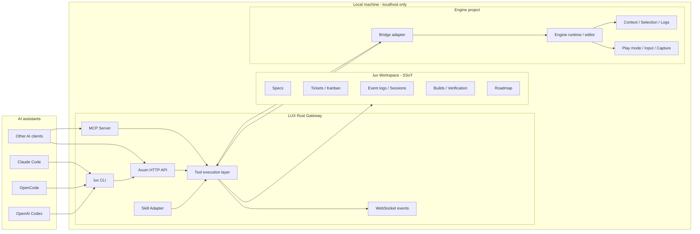

# LUX - Local-first Server/MCP Evidence Loop for Game Automation

Language: **English (base)** | [Korean](README.ko.md)

This English README is the base version. Keep `README.ko.md` as the Korean translation of this document, and update the English version first when product direction or repository structure changes.

**LUX** = **L**inalab **U**nity **X**

LUX is a local-first server/MCP evidence-gated automation control plane for game projects. It connects AI coding tools to engine projects through installed bridge adapters, records runtime truth under `.lux/`, and exposes verified project state through CLI, HTTP/WebSocket, and MCP surfaces.

Unity is the primary public-beta verified engine path. Godot and Three.js support must stay inside explicit capability tiers so planned, partial, or adapter-only behavior is not presented as completed product behavior.

## What LUX Is

LUX is not a Unity package and not a target game project. It is an independent local server and CLI that sits between AI assistants and engine projects.

The core problem is that AI coding tools understand source files but usually cannot see the current engine state: selected objects, PlayMode, compile logs, scene hierarchy, coordinates, camera state, UI layout, screenshots, and run results. LUX makes those surfaces observable and repeatable before an agent claims progress.

The basic flow is:

1. Install an engine bridge adapter into the target project.
2. Run the Rust gateway locally.
3. Let AI tools use CLI, HTTP/WebSocket, or MCP commands.
4. Record runtime truth and evidence under `.lux/`.
5. Verify behavior through engine status, compile/test/run output, screenshots, logs, or structured run evidence.

## LUX Rhythm

LUX moves in a fixed loop: capture local truth, decide from evidence, act through the gateway, verify through the engine or `.lux/`, then write the result back as durable context. The loop is intentionally slower than a direct code edit because it keeps AI agents from claiming progress from stale assumptions.

1. **Observe** - read `.lux/`, project files, engine capability state, Unity bridge status, logs, scene hierarchy, screenshots, and recent run evidence.
2. **Route** - choose the verified surface for the engine and task. Unity can use the full bridge-backed path; Godot and Three.js must stay inside their declared maturity tier.
3. **Act** - run CLI, HTTP/WebSocket, MCP, or bridge commands through the Rust gateway instead of mutating runtime state from side channels.
4. **Verify** - capture compile/test/run/status evidence before presenting behavior as done.
5. **Project** - expose the proven state back through README, `docs/`, skills, CLI output, and `.lux/` summaries without turning planned capabilities into completed claims.

This rhythm makes LUX a local-first control plane, not a GUI product, remote streaming stack, or target game repository.

## Content Areas

| Area | What it is | What belongs there | What does not belong there |
| --- | --- | --- | --- |
| `.lux/` | Runtime truth | Specs, capability status, tickets, events, roadmap, sessions, run evidence | Duplicated cache truth or hand-maintained docs-only state |
| `gateway/` | Control-plane runtime | Rust CLI, Axum HTTP/WS server, MCP tools, endpoint routing, engine command orchestration | Unity Editor windows, dashboards, frontend apps |
| `crates/` | Shared Rust packages | Reusable core logic split out of gateway responsibilities | Server wiring that belongs in `gateway/` |
| `bridge/` | In-repository engine bridge source | Unity C# bridge package, Godot adapter files, Three.js adapter sources that `lux bridge install` can copy into target projects | Git submodules, external bridge repositories, target Unity project state, vendored dependency directories |
| `Skills/` | Agent workflow library | Manifest-backed skills, references, catalogs, and templates projected into target projects | Claims that a workflow is engine-verified without matching gateway/bridge evidence |
| `docs/` | Human-readable projection | Usage, ADRs, support tiers, roadmap explanation, and design constraints | The canonical runtime state when `.lux/` disagrees |
| `scripts/` | Local verification and maintenance | Structure checks, policy scans, smoke scripts, release/test helpers | Long-running product surfaces or hidden runtime state |

Bridge sources are ordinary files in this repository. Do not initialize `bridge/` as a git dependency, and do not point it at `lux-bridge` or any other remote bridge repository. If bridge behavior changes, the source change should be visible in this repo beside the gateway code that installs or talks to it.

## Engine Capability Snapshot

Engine support uses capability routing, not equal verification maturity. Unity is the primary verified path. Godot and Three.js entries expose only the commands and evidence levels that are actually supported.

| Engine | Public maturity | Notes |
| --- | --- | --- |
| Unity | verified | Primary public-beta path for bridge, status, compile/test/run evidence. |
| Godot | partial | Detection, bridge install, status, and workflow skill projection only; build/run/test stay unsupported. |
| Three.js | planned | Adapter files may exist, but Three.js remains planned unless a runtime harness is present and verified. |

| Capability | Unity | Three.js | Godot |
| --- | --- | --- | --- |
| Project detection | verified | planned | verified |
| `.lux` workspace | verified | planned | planned |
| Bridge install | verified | planned | verified via `--type godot` |
| Status | verified | planned | verified with separated `gopeak.*` and `lux.*` fields |
| Build/run/test | verified for Unity paths | planned | unsupported until GoPeak-backed verification exists |
| `.agents` workflow skill | verified | planned | verified via `lux-godot` |

See [`docs/godot-support.md`](docs/godot-support.md) for Godot-specific capability status.

## Architecture



## Core Surfaces

### Game Context Adapter

LUX is context-first, not vision-first. It standardizes the evidence an AI agent needs before editing or claiming a game behavior:

| Observation unit | Purpose |
| --- | --- |
| GDD/spec map | Keep game intent and domain decisions under `.lux/specs`. |
| Scene hierarchy | Read active scenes, GameObjects, and parent/child structure. |
| Selected object and components | Inspect Transform, RectTransform, Collider, Renderer, scripts, and references. |
| Coordinates and camera | Validate world/screen coordinates, camera targets, and 2D/3D axis assumptions. |
| UI layout | Inspect Canvas, anchors, RectTransform, and off-screen placement. |
| Console and compile logs | Connect code changes to actual failures. |
| PlayMode and input trace | Verify runtime loops, input replay, and play-state behavior. |
| Screenshot / vision evidence | Add visual evidence only after text/JSON state is captured where possible. |
| Ticket / run / capability links | Tie observations back to `.lux/`, tickets, run evidence, and engine capability state. |

### CLI

Common commands:

```bash
# Install and run the gateway
cargo install --path gateway
lux serve

# Initialize a target project and install the Unity bridge
cd /path/to/your/project
lux init
lux bridge install --project-path /path/to/your/unity-project
lux mcp install --project-path /path/to/your/unity-project

# Unity status and verification
lux unity status
lux unity context
lux unity compile
lux unity run-tests
lux unity play
lux unity screenshot

# Specs, roadmap, tickets, and GitHub issues
lux spec
lux spec edit gdd
lux spec validate
lux roadmap status
lux kanban
lux verify

# Skills and logs
lux skill list
lux skill info my-skill
lux ai-log recent
lux ai-log tail
```

### HTTP, WebSocket, and MCP

Representative API surfaces:

| Surface | Examples |
| --- | --- |
| Health | `GET /health`, `GET /api/health`, `POST /api/heartbeat`, `GET /schema` |
| Project and bridge | `POST /api/project/detect`, `POST /api/bridge/install`, `POST /api/compile` |
| Unity run/capture | `GET /api/unity/runs`, `POST /api/unity/runs`, `POST /api/unity/capture/sessions` |
| Events and logs | `GET /events`, `GET /api/events`, `GET /api/ai-log`, `GET /api/ai-log/context` |
| Sessions and tools | `GET /api/sessions`, `POST /api/tools/execute`, `GET /api/tools/executions/:execution_id` |
| Lux state | `POST /api/lux/init`, `GET /api/lux/spec`, `GET /api/lux/progress/summary` |
| Build and verification | `POST /api/lux/build/start`, `POST /api/lux/verify/run`, `GET /api/lux/verify/latest` |
| Kanban and terminal | `GET /api/lux/kanban/board`, `POST /api/lux/terminal/create` |
| MCP | `lux mcp install --project-path <project>` writes the project `.mcp.json`; `lux mcp --project-path <project>` exposes bounded game-development loop tools over JSON-RPC stdio. |

## `.lux/specs` Game Spec System

Game intent and domain decisions live under `.lux/specs/`. README files and `docs/` are readable projections of that state. Actual game requirement changes should be recorded through the defined `.lux/specs/spec.json`, `.lux/specs/gdd.md`, `.lux/specs/domains/*.md`, and `.lux/specs/decisions.jsonl` write paths.

| Domain | Purpose |
| --- | --- |
| `gdd` | Game intent and player promise |
| `mechanics` | Core rules and interactions |
| `controls` | Input, controls, accessibility |
| `camera` | Viewpoint, tracking, screen coordinates |
| `levels` | Level structure and progression |
| `art-style` | Visual art direction |
| `audio` | Audio design |
| `narrative` | Story and dialogue |
| `ui-ux` | UI/UX specification |
| `technical-architecture` | System architecture |
| `engine` | Unity/Godot/Three.js capability routing |
| `testing` | Automated and manual QA strategy |
| `build-release` | Build, release, deployment |

## Repository Structure

```text
Lux/
├── gateway/                        # Rust CLI + Axum HTTP/WS server
│   ├── src/
│   │   ├── main.rs                 # CLI entry point
│   │   ├── server.rs               # Axum router
│   │   ├── protocol.rs             # Event envelope and bridge protocol
│   │   ├── project.rs              # Unity project detection
│   │   ├── project_godot.rs        # Godot project detection
│   │   ├── bridge_types.rs         # Bridge type definitions
│   │   ├── godot_bridge_install.rs # Godot bridge install path
│   │   ├── lux_*.rs                # Lux core modules
│   │   ├── uloop_*.rs              # Unity CLI passthrough
│   │   ├── skill_adapter/          # Skill loading and adaptation
│   │   └── templates/              # Gateway-managed templates
│   ├── tests/
│   └── Cargo.toml
│
├── crates/                         # Shared Rust core packages
├── bridge/                         # Engine bridge adapters, in-repo source
│   ├── unity/                      # Unity C# bridge
│   ├── godot/                      # Godot bridge
│   └── threejs/                    # Three.js adapter files
├── Skills/                         # Skill source tree
├── docs/                           # Human-readable docs and ADRs
├── scripts/                        # Verification and maintenance scripts
├── Cargo.toml
├── Cargo.lock
└── LICENSE
```

## Roadmap Reality

The minimal runtime roadmap and milestone status lives in `.lux/roadmap.json`. User/game requirements, execution tickets, and active run state live under the ADR-003 domain paths such as `.lux/specs/spec.json`, `.lux/specs/domains/*.md`, `.lux/tickets/*.json`, and `.lux/run-state.json`.

Repository-level Lux roadmap work and unaddressed product features are tracked in GitHub Issues. Local `.ledger`-style files are only for local worktree decision recording; they must not become the roadmap backlog or collaborator-visible feature registry.

| Phase | Name | Status | Description |
| --- | --- | --- | --- |
| A | Core Gateway & CLI | complete | Rust gateway, CLI, bridge adapter integration |
| B | AI Event System | complete | Event logging, JSONL, session API |
| C | Server and MCP Control Plane | complete | Rust CLI, HTTP/WS API, MCP server |
| D | Agent Workflow Skill Projection | partial | Manifest inventory and target-project skill projection |
| E | Ticket-driven Agent Execution | planned/scaffolded | Gateway/MCP evidence path without a legacy adapter root |

Out of scope for the current public-beta framing:

- Automatic GitHub milestone/issue sync unless a supported GitHub issue-registration surface is implemented.
- WebRTC or remote video streaming unless explicitly gated behind experimental flags.
- Browser-based remote control of Unity Editor.
- iOS companion app or PWA.
- Windows/Linux editor support beyond documented capability tiers.

## Core Invariants

The repository follows six invariants adapted from `alex-core-invariants`:

| # | Invariant | Lux guidance |
| --- | --- | --- |
| 1 | SSoT | `.lux/` owns specs, tickets, logs, roadmap, sessions, and run evidence. |
| 2 | SoC / SRP | Gateway owns server and CLI; bridge owns engine protocol; Skills owns workflows. |
| 3 | Consistency | Event schemas, API response shapes, and bridge protocol messages must stay aligned. |
| 4 | Atomicity | Multi-step bridge/API operations must complete fully or fail observably. |
| 5 | Idempotency | Repeated bridge install, heartbeat, and status operations must converge. |
| 6 | No Silent Fallback | Do not return empty/default data or fall back to legacy paths without observable evidence. |

Allowed transition markers:

- `// lux-allow-failover`
- `// lux-allow-legacy`
- `// lux-allow-dual-write`

## Verification

```bash
# Rust
cargo build --workspace
cargo test --workspace

# Project checks
bash scripts/check-project-structure.sh
bash scripts/check-readme-bridge-contract.sh
bash scripts/test-all.sh --quick

# CLI help
cd gateway && cargo run -- bridge install --help
cd gateway && cargo run -- serve --help
```

Unity bridge tests require Unity Editor and should be run through the Unity Test Runner for the bridge package.

## License

Copyright (c) 2024-2026 Linalab. All rights reserved.
